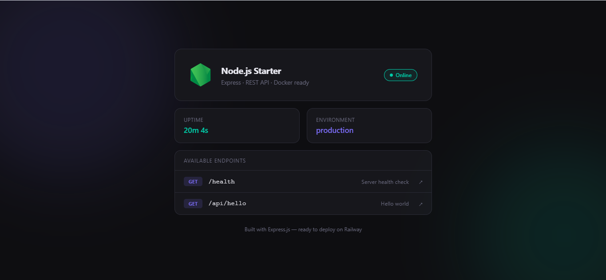

# Node.js Express Starter

[](https://railway.com/deploy/nodejs-starter?referralCode=asepsp&utm_medium=integration&utm_source=template&utm_campaign=generic)

A minimal, Docker-ready Node.js web application built with Express.js.



## Tech Stack

- **Runtime** — Node.js 20 (Alpine)
- **Framework** — Express.js
- **Config** — dotenv
- **Dev** — nodemon
- **Deploy** — Docker / Dokploy

## Project Structure

```
project/
├── public/         # Static files (HTML, CSS, JS)
├── routes/
│   └── index.js    # Route definitions
├── .env.example
├── .dockerignore
├── .gitignore
├── Dockerfile
├── LICENSE
├── package.json
└── server.js       # App entry point
```

## Getting Started

### Local Development

```bash
npm install
cp .env.example .env
npm run dev
```

### With Docker

```bash
docker build -t nodejs-starter .
docker run -p 3000:3000 --env-file .env nodejs-starter
```

Open [http://localhost:3000](http://localhost:3000)

## Endpoints

| Method | Path         | Description         |
| ------ | ------------ | ------------------- |
| GET    | `/`          | Landing page        |
| GET    | `/health`    | Server health check |
| GET    | `/api/hello` | Hello world         |

## Environment Variables

| Variable   | Default       | Description      |
| ---------- | ------------- | ---------------- |
| `PORT`     | `3000`        | Server port      |
| `NODE_ENV` | `development` | Environment mode |

## Deployment (Dokploy)

1. Push project to GitHub / GitLab
2. Create a new **Application** in Dokploy
3. Connect your repository
4. Dokploy auto-detects the `Dockerfile` and builds the image
5. Set environment variables in the **Environment** tab
6. Deploy

## License

MIT © 2025 Asep Saputra